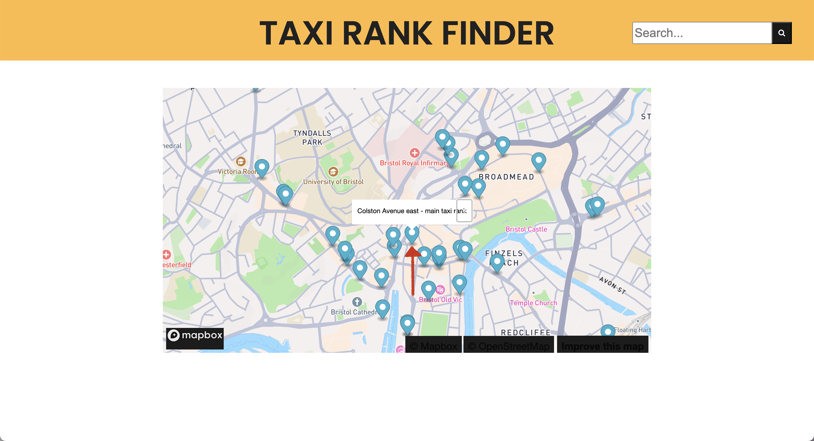

# Deployment

## Release Notes
The current version of our taxi rank finder website is version 1.0.0. It is built using HTML, CSS, JavaScript, and the Mapbox GL JS library for mapping functionality. It relies on the user's browser supporting geolocation for optimal performance. 

Some known issues include that it only displays taxi ranks in central Bristol, so it may not be as useful to users far from the Bristol city centre. Moreover, there may be occasional inaccuracies in taxi rank data due to external data sources.

The UML Deployment diagram below illustrates the deployment of software components to hardware nodes. The taxi rank finder website displays a dependency on Bristol Open Data.

# User guide
This user guide provides a full walkthrough of how to use our Taxi Rank Finder website. It is divided into two sections depending on our two use cases - Use case 1: Find your nearest taxi rank and use case 2: Find taxi by operating time.

## Use Case 1
1. Head to the section displaying “Find the nearest taxi rank” and click on the “GO” button underneath the text.

2. Depending on your preferences, choose whether you would like the site to access your location or not.

3. You will be redirected to a page displaying a map with markers representing the locations of many taxi ranks in central Bristol.

4. Choose a marker to display additional information regarding a taxi rank’s location.

## Use Case 2
1. Head to the section displaying "Find taxi by operating time" and click on the "GO" button underneath the text.

.png)

2. You will be directed to a page displaying a table containing the location of taxi ranks and their operating time.

.png)

3. Click on the "Part Time" button to find taxi ranks that operate part-time.

.png)

4.  Click on the "Full Time" button to find taxi ranks that operate full-time.

.png) 
