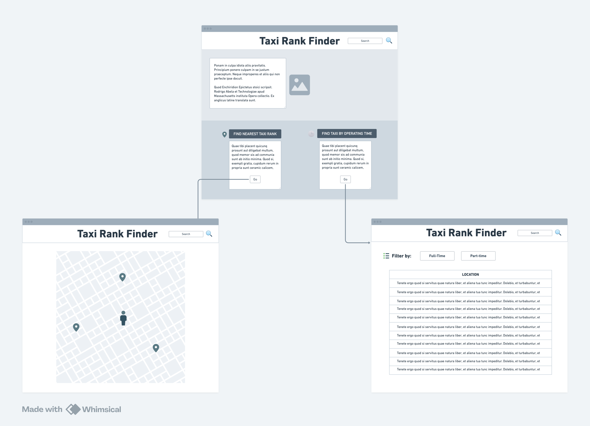
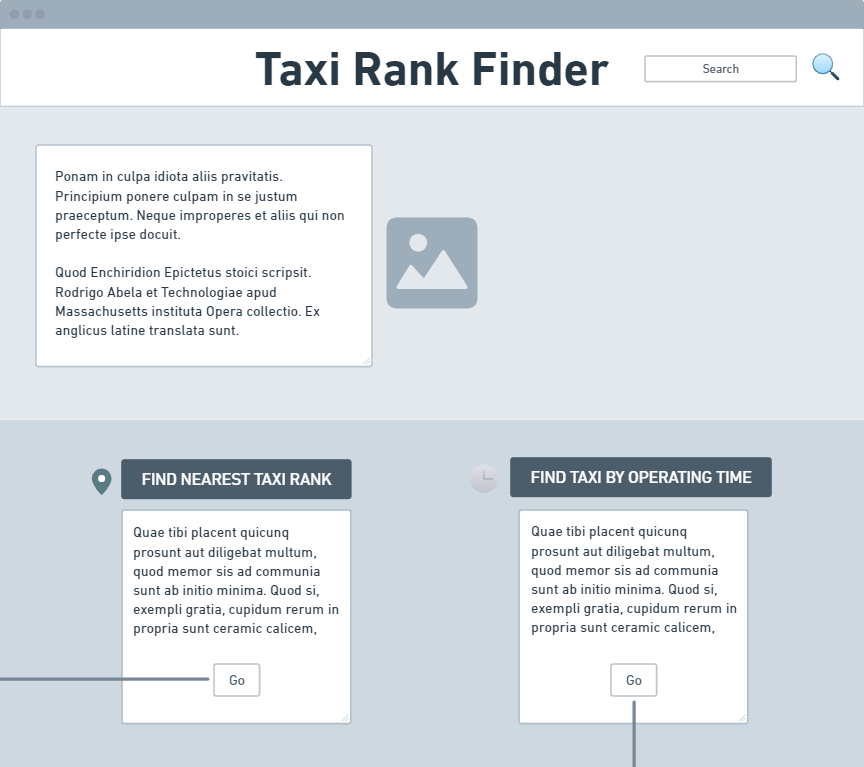
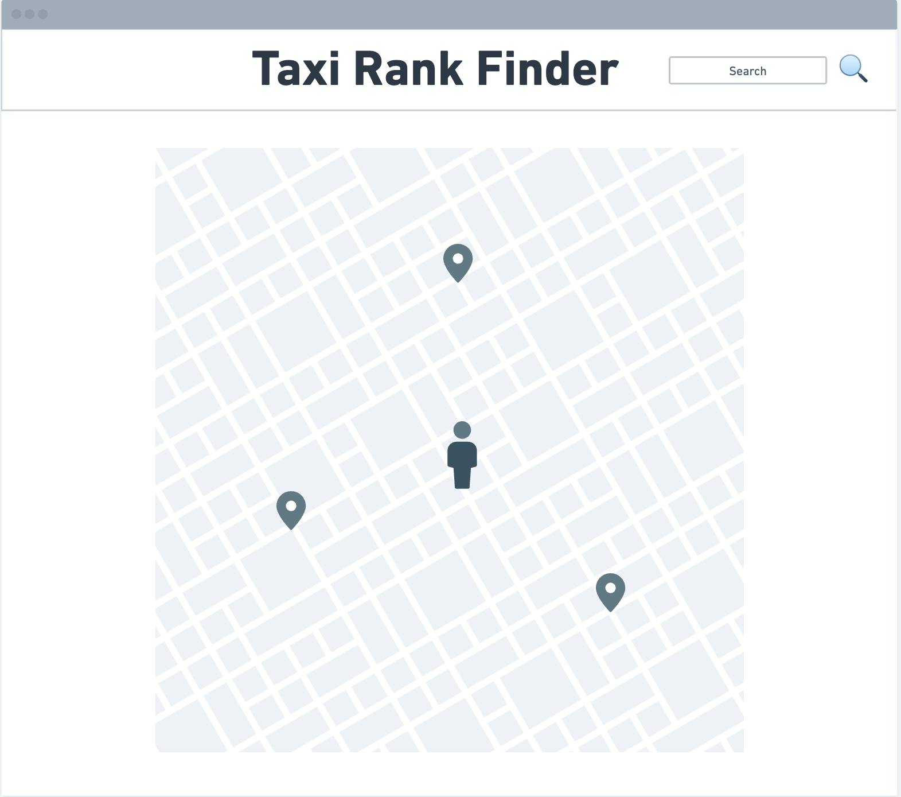
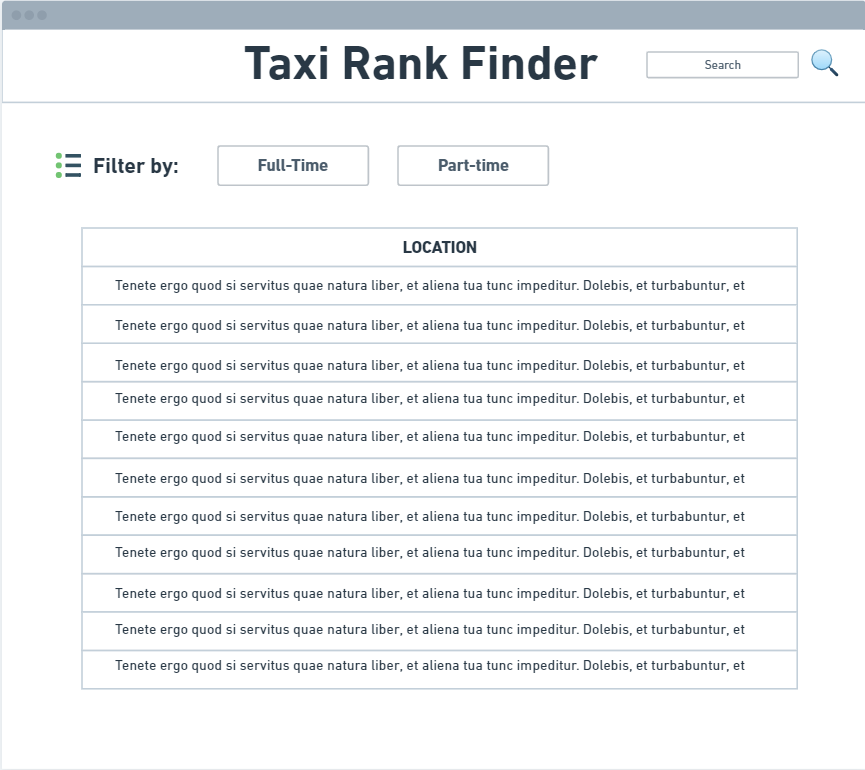

# Design

## User Interface Design

### Overview
This is a wireframe displaying the full overview of our website which was made using Whimsical. It consists of a splash page, a page to find the nearest taxi rank, and a page to find a taxi rank based on its operating time. 
- We wanted our design to not only be sleek and modern, but also functional. Therefore, we divided our splash page into clear sections and added elements such as images and icons to provide the user with a visually stimulating experience.
   

### The main page
This is the splash page of our website. Its header contains the website title, "Taxi Rank Finder", and a search function in the top-right corner. Underneath, is a section containing a photo of taxis along with a welcome message for the user, guiding them to the navigation section. The navigation section is where our use cases reside - there are two sub-sections with short descriptions and "go" buttons that will either lead the user to a new page to find the nearest taxi rank or a new page to find a taxi rank based on its operating time.
 

### UC1: Find the nearest taxi rank 
Our page for UC1 still retains the same header as the splash page. The main difference is that it only displays a map below. This map will have numerous markers which show the locations of different taxi ranks in Bristol. Upon clicking these markers, it will show the specific address of the taxi rank, so that the user can easily find its location.
   

### UC2: Find the taxi rank by operating time
Similar to our UC1 page, the page for UC2 also retains the same header as our splash page, enforcing consistency across our website. This page contains a table which displays the addresses for each taxi rank and its respective time availability i.e. whether it operates full-time or part-time. Moreover, above this table, there are two buttons ("Full-time" or "Part-time") that the user can press to present a table that only shows either full-time or part-time taxi ranks, depending on the user's preference. 
 

