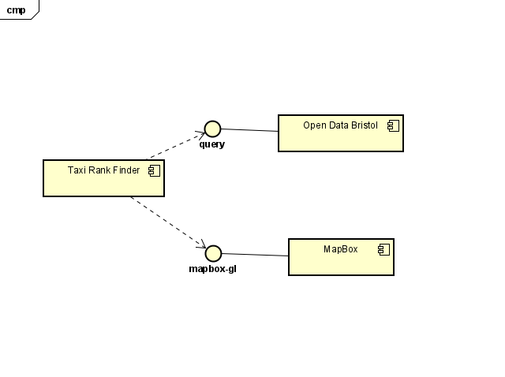
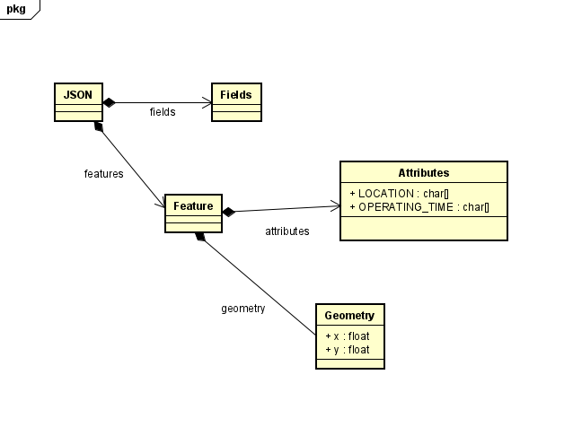

# Implementation

## Introduction
Our taxi rank finder website facilitates convenient access to nearby taxi ranks and operational information tailored to users' preferences. Using a dataset consisting of taxi rank locations and operating hours, users can efficiently locate available taxis. The system utilises configurable parameters, such as displaying taxi ranks within a one-mile radius and accommodating operating time preferences, to provide personalised search results.

## Project Structure
Below is a visual representation of our project folder structure - the main folder "ISD" contains multiple sub-folders and a file.
- Taxi Rank Finder: sub-folder containing all HTML, CSS, JavaScript and any miscellaneous (e.g. images) files.
- Documentation templates: sub-folder containing the documentation templates that are used to document the process of this project.
- Diagrams: sub-folder containing all diagrams (made with Astah) which display different operations in our project e.g. use-case and class diagrams
- readme.md: markdown file providing a general overview of the project and links to documentation files.

```
├── ISD
  ├── Taxi Rank Finder
│     ├── index.html
│     ├── map.html
│     ├── operating.html
│     ├── script.js
|     ├── style.css
│     └── taxi-photo.png
  ├── documentation templates
  ├── diagrams
  └── readme.md
```

## Software Architecture
The three major components of our architecture include: Taxi Rank Finder, Open Data Bristol and Mapbox. The Taxi Rank Finder component interacts with the Open Data Bristol component via a 'query' interface whereas it interacts with the 'MapBox' component via a mapbox-gl interface. 

 

## Bristol Open Data API
We utilise the Bristol Open Data API to gather information about the locations and operating times of taxi ranks in Bristol. Each query to the API includes specific inputs such as location coordinates and operating time criteria to refine the results depending on user preferences. This allows users to easily locate nearby taxi ranks and determine their availability in real time.



