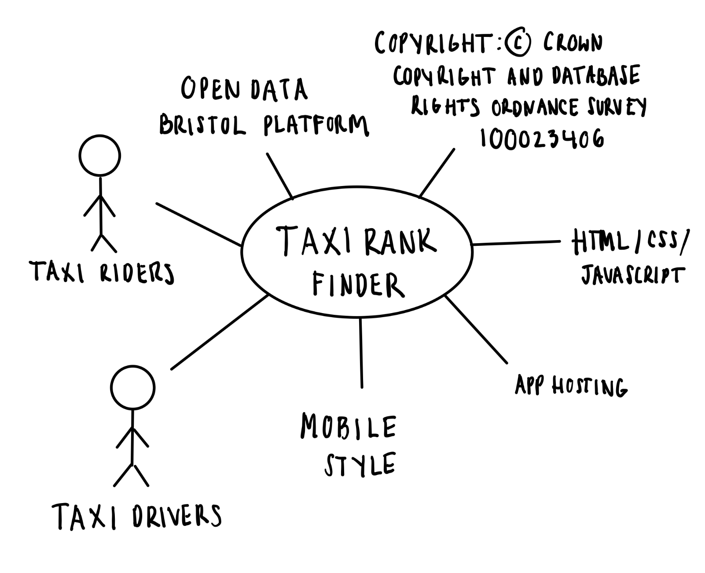

# Project Proposal

## Business Case

### Problem statement
Locating taxi ranks can be challenging for customers, especially in unfamiliar areas or during peak hours, showing inefficiency. Moreover, difficulty in finding taxis leads to customer frustration, missed appointments, and potentially, reduced usage of taxi services.

### Business benefits
For Taxi Riders:
- Convenience: Riders can easily locate the nearest taxi rank, reducing waiting times and increasing travel convenience
- Time and Cost Savings: Fewer delays lead to savings in time and money 
- Improved Safety: Knowing the exact location of taxi ranks enhances rider safety

For Taxi Companies:
- Increased Customer Base: The website will attract new customers to the taxi industry, increasing potential revenue streams
- Reduced Empty Cruising: Improved visibility of taxi ranks can reduce empty cruising, saving fuel and reducing emissions
  
### Options Considered
- Other modes of transportation e.g. buses, trains, cars, or walking
- Uber
- SWOOP (Taxi app used in Southwest England)

### Expected Risks
Competition: Potential entry of competitors into the market  
Dependence on Technology: Vulnerability to technical issues  
Data Privacy: Handling user data securely to maintain trust  

## Project Scope
- System: Taxi Rank Finder
- Actors: General Public, Taxi drivers
- Data obtained from "Open Data Bristol"
- License: Copyright: © Crown Copyright and database rights. Ordnance Survey 100023406.
- The app will be hosted on the web
- The app will also have a mobile style as it will be more efficient for users to access the app on a phone
- HTML/CSS/JS Technology

