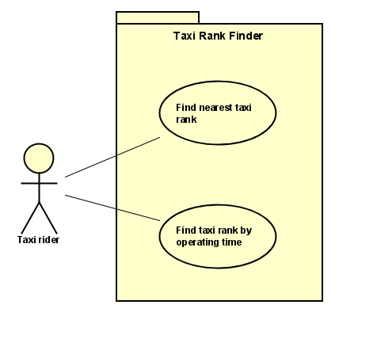

# Requirements

## User Needs

### User stories
**User story 1:** As a customer, I want to find the nearest taxi rank, in case I am late for an appointment.  
**User story 2:** As a taxi driver, I want customers to find taxi ranks easily so that the taxi industry will have an increased customer base, resulting in a higher wage.

### Actors
1) Taxi Riders - use taxis to get to a destination. 
2) Taxi Drivers - pick up and drive the customers to their destination.

### Use Cases
**UC1** - Find nearest taxi rank  
**UC2** - Find taxi rank by operating time

| UC1 | Find nearest taxi rank | 
| -------------------------------------- | ------------------- |
| **Description** | As a customer, I want to find the nearest taxi rank. |
| **Actors** | Taxi rider |
| **Assumptions** | Browser supports geo-location </td></tr> |
| **Steps**       | <li> Request Permission to access user location.</li><li>Give permission for geo-location (on request). </li><li>Get nearest taxi ranks from database.</li><li>Display nearest taxi ranks from user location on map. </li>|
| **Variations** | The browser doesn't support geolocation |
| **Non-functional** | The service should run on Chrome |

| UC2 | Find taxi rank by operating time | 
| -------------------------------------- | ------------------- |
| **Description** | As a customer, I want to find taxi ranks by operating time.  |
| **Actors** | Taxi rider |
| **Steps**       | <ol><li>Opt to view table of taxi ranks by operating time.</li><li>Opt to view table of taxi ranks that operate full-time/part-time.</li><li> Get full-time/part-time taxi ranks from database.</li>|
| **Non-functional** | The taxi ranks (filtered by operating time) should be displayed in less than a second|

## Use-Case Diagram
This is our use-case diagram which models the behaviour of our user. It displays an actor (a customer/taxi rider) who is associated with two use cases embedded within a system: "Find the nearest taxi rank" and "Find taxi rank by operating time".

## Software Requirements Specification
### Functional Requirements
**FR1.1:** The system should get user geo-location from navigator.geolocation.  
**FR1.2:** The system must query the database for taxi rank locations from Open Data Bristol.  
**FR1.3:** The system should centre the map on the user's location using the map object.  
**FR1.4:** The system must add markers for each taxi rank using the map object.  
**FR2.1:** The system must query the database for full-time and part-time taxi ranks from Open Data Bristol.   

### Non-Functional Requirements
**NFR0.1:** The app should work on different browsers e.g. Chrome or Safari (compatibility)  
**NFR0.2:** The app should work on a mobile device or laptop. (portability)  
**NFR0.3:** No security is required. (security)  
**NFR0.4:** The data should be up-to-date; less than one year old. (functional suitability)  
**NFR0.5:** The source code should be available on GitHub. (maintainability)  
**NFR1.1:** It should display up to 10 of the nearest taxi ranks on one page. (usability)  
**NFR1.2:** It must assume a sensible default on a browser with no user geolocation. (reliability)  
**NFR1.3:** The listed taxi ranks should be no further than 1 mile from the customer. (usability)  
**NFR2.1:** The app should take a maximum of 5 seconds to load. (performance efficiency)  
